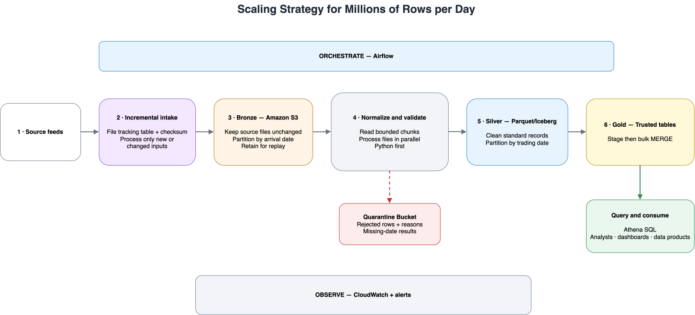

# Market Data Pipeline

Local Python and SQLite pipeline for daily cryptocurrency OHLCV files.

The project uses three logical layers:

- **Bronze:** original CSV files, unchanged.
- **Silver:** normalized and validated Python records.
- **Gold:** trusted SQLite tables for analyst queries.

## Requirements

- Python 3.10 or newer
- SQLite CLI only if you want to run the example SQL commands

The pipeline runtime uses only the Python standard library.

## Run the pipeline

From the repository root:

```bash
python3 -m src.main
```

The command loads all six venue files and both reference files, then creates:

```text
output/prices.db
```

Check the database tables:

```bash
sqlite3 output/prices.db ".tables"
```

Expected tables:

```text
daily_ohlcv  daily_reference_price  rejected_rows  missing_dates
```

## Run the tests

From the repository root:

```bash
python3 -m unittest discover -s tests -v
```

The tests currently verify that:

- Applying the schema twice succeeds and does not create duplicate tables.
- A valid Binance row is normalized into the canonical candle format.
- The known invalid Binance OHLC row is rejected by validation.
- Loading Binance BTCUSD twice leaves exactly 119 trusted rows.
- Structural-only loading leaves 700 OHLCV rows; the complete pipeline's reference check reduces this to 698.
- Complete reruns preserve every stored value, including load timestamps.
- Rejected rows and missing dates are recorded.
- A failure in the last source rolls back the entire run.
- Conflicting duplicates are rejected and obsolete trusted rows are removed.
- Gemini epoch timestamps and symbols are normalized correctly.

The suite also contains regression tests for the inherited loader. Those tests
will fail while `load_prices.py` remains in its original state; they become the
acceptance criteria for the Part 2 implementation.

## Check rerun safety

Run against a test DB:

```bash
python3 -m src.main --db /tmp/part1-prices.db
python3 -m src.main --db /tmp/part1-prices.db
```

Both runs should complete successfully. Confirm the trusted row count:

```bash
sqlite3 /tmp/part1-prices.db \
  "SELECT COUNT(*) FROM daily_ohlcv; SELECT COUNT(*) FROM daily_reference_price;"
```

Expected result:

```text
698
240
```

## Project layout

```text
data/
├── raw_feeds/              # Bronze input files
└── new_source/             # Gemini input files

src/
├── main.py                 # Entry point
├── adapters.py             # Source normalization
├── validation.py           # Data-quality rules
├── database.py             # SQLite setup and persistence
├── loader.py               # Loading, validation, and deduplication
├── models.py               # Canonical records
├── helpers/config.py       # Per-source paths, schemas, and adapters
└── ddl/schema.sql          # Gold and audit table definitions

de_take_home_data/starter_pipeline/
├── load_prices.py          # Inherited loader
└── README.md               # Inherited behavior and verification guide

output/prices.db            # Produced SQLite database
tests/                      # Automated tests
README.md                   # Run guide, design note
```

## Architecture


## Inspect quality results

```bash
sqlite3 -header -column output/prices.db "SELECT source_file, source_row_number, reasons FROM rejected_rows;"
sqlite3 -header -column output/prices.db "SELECT * FROM missing_dates;"
sqlite3 -header -column output/prices.db "SELECT venue, symbol, COUNT(*) AS rows FROM daily_ohlcv GROUP BY venue, symbol;"
```

Expected: 8 rejected rows, 6 skipped exact duplicates, and 14 missing input dates
(March 4–10 for both Coinbase assets). Missing dates are not filled.
Binance has 118 rows per asset, Kraken 119, and Coinbase 112.

Closes more than 20% from the same-date reference are rejected. This catches
the two January 30 Binance outliers. Override with `--max-deviation 0.20`.
This is a coarse outlier check, not a guarantee of market-price accuracy.

Each input file is a complete snapshot for its symbol/source over January–April
2026. A successful run removes rows from that source which no longer pass.
The full data load and current quality reports commit together; malformed or
missing files abort the run. Reruns preserve trusted rows and refresh the audit
tables to the same contents. Logs before the final “Committed” message are provisional.

To use a separate database:

```bash
python3 -m src.main --db /tmp/coinhako-prices.db
```

To override the input folder:

```bash
python3 -m src.main --raw-dir data/raw_feeds
```

## Inherited loader 
The inherited loader is located at:

`de_take_home_data/starter_pipeline/load_prices.py`

It was fixed to use the shared schema, adapters, validation, transactions, and
idempotent upserts. It was also extended to load Gemini BTCUSD and ETHUSD through
the shared source configuration.

Run it from the repository root:

```bash
python3 de_take_home_data/starter_pipeline/load_prices.py
```


## Design note

### 1. Why did I choose this schema and grain?

| Table | Grain | Purpose |
| --- | --- | --- |
| `daily_ohlcv` | One row per venue, symbol, and trading date | Trusted daily market data |
| `daily_reference_price` | One row per symbol and trading date | Benchmark used by quality checks |
| `rejected_rows` / `missing_dates` | One row per detected issue | Audit trail kept outside trusted data |

The primary key `(venue, symbol, trading_date)` represents one unique daily
candle and prevents duplicate records.The reference feed is stored separately because it is a benchmark, not a trading
venue, and therefore has a different grain of one row per symbol and date.
Rejected rows and missing dates are also stored separately so analysts only
query validated records from the trusted table.

Each trusted row includes `source_file` and `source_row_number`, allowing it to
be traced back to the original input. The validation rules follow basic OHLCV
logic: prices must be positive and finite, volume cannot be negative, the high
must be the highest candle value, and the low must be the lowest. Conflicting
keys and unusually large reference-price differences are also detected.

SQLite was selected because it runs locally without additional infrastructure
and produces one portable database file. The pipeline uses logical medallion
layers: source CSVs are Bronze, normalized and validated records are Silver, and
trusted SQLite tables are Gold.

The source files describe the same daily OHLCV event but use different column
names, timestamp formats, and symbol formats. I normalize them into one `Candle`
model so validation, database loading, and analyst queries do not need
source-specific logic.

The model contains the common business fields shared by the feeds: venue,
symbol, trading date, OHLC prices, and volume. `volume_unit` preserves differences
in how venues report volume, while `source_file` and `source_row_number` provide
provenance.

### 2. What did I fix in the inherited script, and why did each fix matter?

| Change | Why it matters |
| --- | --- |
| Resolve paths from the project location | The script works from any directory |
| Use the shared schema and loader | Both entry points produce the same trusted data |
| Validate columns, prices, volume, and OHLC values | Invalid rows cannot enter trusted tables |
| Use a primary key and conditional upsert | Reruns do not create duplicates; corrected rows can be updated |
| Load all files in one transaction | A serious failure rolls back the incomplete run |
| Add structured logs and CLI path options | Runs are easier to operate, investigate, and test |
| Add a Gemini adapter and source configuration | A new file format is supported without adding special cases to the shared loader |

The Gemini adapter changes Gemini’s data into the same format as the other venues. It changes symbols such as BTC-USD to BTCUSD, converts the timestamp into a Singapore date, and renames Gemini’s price and volume fields. Gemini data still goes through the normal price, volume, and OHLC checks. The reference-price check is disabled for Gemini because it is unclear whether Gemini and the reference feed define their daily prices in the same way. In production, I would confirm this before deciding whether a large difference should be rejected or only reported as a warning.

### 3. How would I schedule, monitor, and alert on this pipeline in production?

I would schedule one daily run after the source delivery deadline:

`check files → load references → normalize and validate venues → publish → final checks`

Airflow could manage the schedule, retries, and task status. Retries are safe
because writes are idempotent.

Each run should record its files, start and end time, status, and counts for rows
read, accepted, rejected, duplicated, and missing. Missing or empty files,
unexpected columns, and failed loads should raise an urgent alert. Unusual row
counts, missing dates, or a higher rejection rate should send a warning for
review.

### 4. Proposed scaling approach


At millions of rows per day, the main limits would be memory use, row-level
database writes, and repeatedly processing old files. I would address these
limits before changing the entire platform.

| Strategy | Approach |
| --- | --- |
| Incremental loading | Track processed files and process only new or changed inputs |
| Memory control | Read and validate records in chunks |
| Faster writes | Load into staging and use a bulk `MERGE` |
| Query performance | Partition by trading date and organize by venue and symbol |
| Efficient storage | Convert CSV files to Parquet |
| Safe retries | Preserve the existing business key and idempotent writes |
| Bad-data handling | Write rejected rows to a separate quarantine area |
| Parallelism | Process independent files and partitions concurrently |
| Observability | Monitor freshness, volume, rejection rate, and run duration |

A production implementation could use Airflow for orchestration, S3 for file
storage, and Parquet with Iceberg for partitioned tables. AWS Glue or Spark
would provide distributed processing only when chunked Python could no longer
meet the required processing time. Athena could provide SQL access to the
trusted Gold tables.

`Sources → incremental ingestion → S3 Bronze → validation → Silver/quarantine → Gold → analysts`