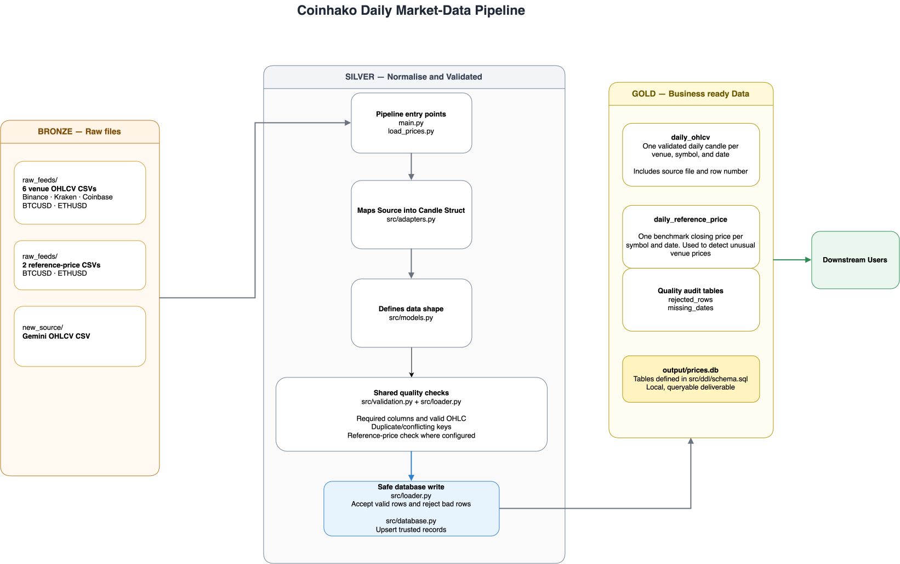

# Market Data Pipeline

Local Python and SQLite pipeline for daily cryptocurrency OHLCV files.

The project uses three logical layers:

- **Bronze:** original CSV files, unchanged.
- **Silver:** normalized and validated Python records.
- **Gold:** trusted SQLite tables for analyst queries.

## Requirements

- Python 3.10 or newer
- SQLite CLI only if you want to run the example SQL commands

The pipeline runtime uses only the Python standard library.

## Run the pipeline

From the repository root:

```bash
python3 -m src.main
```

The command loads all six venue files and both reference files, then creates:

```text
output/prices.db
```

Check the database tables:

```bash
sqlite3 output/prices.db ".tables"
```

Expected tables:

```text
daily_ohlcv  daily_reference_price  rejected_rows  missing_dates
```

## Run the tests

From the repository root:

```bash
python3 -m unittest discover -s tests -v
```

The tests currently verify that:

- Applying the schema twice succeeds and does not create duplicate tables.
- A valid Binance row is normalized into the canonical candle format.
- The known invalid Binance OHLC row is rejected by validation.
- Loading Binance BTCUSD twice leaves exactly 119 trusted rows.
- Structural-only loading leaves 700 OHLCV rows; the complete pipeline's reference check reduces this to 698.
- Complete reruns preserve every stored value, including load timestamps.
- Rejected rows and missing dates are recorded.
- A failure in the last source rolls back the entire run.
- Conflicting duplicates are rejected and obsolete trusted rows are removed.
- Gemini epoch timestamps and symbols are normalized correctly.

The suite also contains regression tests for the inherited loader. Those tests
will fail while `load_prices.py` remains in its original state; they become the
acceptance criteria for the Part 2 implementation.

## Check rerun safety

Run Part 1 twice against a separate test database:

```bash
python3 -m src.main --db /tmp/part1-prices.db
python3 -m src.main --db /tmp/part1-prices.db
```

Both runs should complete successfully. Confirm the trusted row count:

```bash
sqlite3 /tmp/part1-prices.db \
  "SELECT COUNT(*) FROM daily_ohlcv; SELECT COUNT(*) FROM daily_reference_price;"
```

Expected result:

```text
698
240
```

## Project layout

```text
data/
├── raw_feeds/              # Bronze input files
└── new_source/             # Gemini input files

src/
├── main.py                 # Entry point
├── adapters.py             # Source normalization
├── validation.py           # Data-quality rules
├── database.py             # SQLite setup and persistence
├── loader.py               # Loading, validation, and deduplication
├── models.py               # Canonical records
├── helpers/config.py       # Per-source paths, schemas, and adapters
└── ddl/schema.sql          # Gold and audit table definitions

de_take_home_data/starter_pipeline/
├── load_prices.py          # Inherited loader
└── README.md               # Inherited behavior and verification guide

output/prices.db            # Produced SQLite database
tests/                      # Automated tests
README.md                   # Run guide, design note
```

## Architecture



Scaled production diagram: [docs/scaled-pipeline-architecture.drawio](docs/scaled-pipeline-architecture.drawio)

## Inspect quality results

```bash
sqlite3 -header -column output/prices.db "SELECT source_file, source_row_number, reasons FROM rejected_rows;"
sqlite3 -header -column output/prices.db "SELECT * FROM missing_dates;"
sqlite3 -header -column output/prices.db "SELECT venue, symbol, COUNT(*) AS rows FROM daily_ohlcv GROUP BY venue, symbol;"
```

Expected: 8 rejected rows, 6 skipped exact duplicates, and 14 missing input dates
(March 4–10 for both Coinbase assets). Missing dates are not filled.
Binance has 118 rows per asset, Kraken 119, and Coinbase 112.

Closes more than 20% from the same-date reference are rejected. This catches
the two January 30 Binance outliers. Override with `--max-deviation 0.20`.
This is a coarse outlier check, not a guarantee of market-price accuracy.

Each input file is a complete snapshot for its symbol/source over January–April
2026. A successful run removes rows from that source which no longer pass.
The full data load and current quality reports commit together; malformed or
missing files abort the run. Reruns preserve trusted rows and refresh the audit
tables to the same contents. Logs before the final “Committed” message are provisional.

To use a separate database:

```bash
python3 -m src.main --db /tmp/coinhako-prices.db
```

To override the input folder:

```bash
python3 -m src.main --raw-dir data/raw_feeds
```

## Part 2 — Inherited loader review

**Status:** the inherited `load_prices.py` has been restored to its original
state. The review below describes what it currently does and the changes still
required. Do not describe these changes as completed until the inherited entry
point has been updated and tested.

### What the inherited script does

The script opens a working-directory-relative `prices.db`, creates an
unconstrained `prices` table, reads only Binance BTCUSD, inserts every CSV row,
commits, prints the total table count, and closes the connection. Because it
always inserts, every successful rerun appends the same rows again.

### Problems to fix

| Current issue | Required change | Why it matters |
|---|---|---|
| `DB` and `SOURCE_FILE` depend on the terminal directory | Build defaults with `Path(__file__)` or accept paths as arguments | The command should work from any directory |
| `prices` has no primary key or constraints | Reuse `src/ddl/schema.sql` and the canonical `daily_ohlcv` table | The database enforces the declared grain and basic invariants |
| Every run executes a blind `INSERT` | Reuse the conditional upsert in `src/database.py` | Reruns must not create duplicates or rewrite identical rows |
| CSV strings go directly into SQLite | Reuse source adapters and typed `Candle` records | Dates and numbers are parsed explicitly before publication |
| There are no quality checks | Reuse `src/validation.py` and store rejection reasons | Invalid OHLCV must not land in the trusted table |
| Binance columns are hardcoded in the loop | Read paths, parsers, and required headers from `SOURCES` in `src/helpers/config.py` | Gemini can use a different format without adding branches to the generic loader |
| Commit and close happen only on the success path | Use a context manager and one transaction | Fatal failures roll back instead of publishing partial data |
| `print` reports only the final table count | Use `logging` and report read, accepted, duplicate, rejected, and written counts | Runs become diagnosable |
| Files are opened without an encoding or newline policy | Use `encoding="utf-8"` and `newline=""` | CSV reading is predictable across environments |

Parameterized SQL is one thing the inherited script already does correctly; it
should be retained wherever SQL is still required.

### Simple implementation order

1. Add `logging` and `pathlib.Path`; replace `print` and relative string paths.
2. Remove the inline `CREATE TABLE` and initialize the shared schema through
   `src.database.initialize_database()`.
3. Remove hardcoded `VENUE`, `ASSET`, and Binance-only field access from the
   loading loop.
4. Load the reference files first, then loop over the shared `SOURCES`
   configuration and call `src.loader.load_ohlcv_file()` with each configured
   parser and required-column set.
5. Keep the entire run in one transaction and persist the existing rejection
   and missing-date audit results.
6. Keep `load_prices.py` as orchestration only. Parsing belongs in
   `src/adapters.py`; validation and database logic should not be copied into it.
7. Run the inherited loader twice against a temporary database and verify that
   the trusted rows and load timestamps are unchanged on the second run.
8. Run the automated test suite and update this status only after it passes.

### Gemini mapping

Gemini should be normalized by `parse_gemini_row()` into the same `Candle`
model:

| Gemini input | Canonical output |
|---|---|
| `symbol` | Validate pair; normalize `BTC-USD` to `BTCUSD` |
| `time_ms` | Parse epoch milliseconds in UTC, then derive the Singapore date |
| `o / h / l / c` | `open / high / low / close` |
| `base_vol` | `volume`, with `volume_unit="base"` |

The first epoch is December 31, 2025 at 16:00 UTC, or January 1, 2026 at
00:00 Singapore time. Singapore trading dates are an explicit assumption;
the timestamp alone does not establish the candle window.

Required headers belong beside the source adapter in `src/helpers/config.py`.
Gemini should then use the same structural validation, deduplication, audit, and
persistence flow as the existing sources.

The supplied Gemini BTC series has five structurally valid closes more than 20%
from the reference feed. Treating that comparison as warning-only is defensible
because the exercise does not state that the two feeds share the same pricing
methodology. Structural failures must still be rejected. State this assumption
explicitly in the walkthrough.

### Interview explanation after implementation

“I first preserved and understood the inherited behavior. I then made its paths
deterministic, replaced the unconstrained append-only table with the shared
trusted schema, and reused the existing adapters, validation, audits, transaction,
and idempotent upserts. I added Gemini through configuration plus a source adapter
instead of putting Gemini-specific conditions in the generic loader. Finally, I
proved rerun safety and rollback behavior with automated tests.”

## Part 3 — Design note

### 1. Why did I choose this schema and grain?

| Table | Grain | Purpose |
| --- | --- | --- |
| `daily_ohlcv` | One row per venue, symbol, and trading date | Trusted daily market data |
| `daily_reference_price` | One row per symbol and trading date | Benchmark used by quality checks |
| `rejected_rows` / `missing_dates` | One row per detected issue | Audit trail kept outside trusted data |

The primary key `(venue, symbol, trading_date)` matches the business meaning of
a daily candle and prevents duplicates. `source_file` and `source_row_number`
allow every trusted row to be traced to its input.

SQLite was selected because it needs no local service and produces one portable
database file. The pipeline uses logical medallion layers: source CSVs are
Bronze, normalized and validated records are Silver, and trusted SQLite tables
are Gold.

### 2. What did I fix in the inherited script, and why did each fix matter?

| Change | Why it matters |
| --- | --- |
| Resolve paths from the project location | The script works from any directory |
| Use the shared schema and loader | Both entry points produce the same trusted data |
| Validate columns, prices, volume, and OHLC values | Invalid rows cannot enter trusted tables |
| Use a primary key and conditional upsert | Reruns do not create duplicates; corrected rows can be updated |
| Load all files in one transaction | A serious failure rolls back the incomplete run |
| Add structured logs and CLI path options | Runs are easier to operate, investigate, and test |
| Add a Gemini adapter and source configuration | A new file format is supported without adding special cases to the shared loader |

The Gemini adapter converts symbols such as `BTC-USD` to `BTCUSD`, converts epoch
milliseconds to a Singapore trading date, and maps Gemini columns to the common
OHLCV model. Standard price, volume, and OHLC checks still apply. The 20%
reference-price rule is disabled for Gemini because the exercise does not confirm
that both feeds calculate their daily prices in the same way.

### 3. How would I schedule, monitor, and alert on this pipeline in production?

I would schedule one daily run after the source delivery deadline:

`check files → load references → normalize and validate venues → publish → final checks`

Airflow could manage the schedule, retries, and task status. Retries are safe
because writes are idempotent.

Each run should record its files, start and end time, status, and counts for rows
read, accepted, rejected, duplicated, and missing. Missing or empty files,
unexpected columns, and failed loads should raise an urgent alert. Unusual row
counts, missing dates, or a higher rejection rate should send a warning for
review.

### 4. How would it behave at millions of rows per day, and what would I change?

The current pipeline would eventually be limited by memory, row-by-row writes,
and SQLite's single writer. I would make these changes first:

| Change | Benefit |
| --- | --- |
| Read files in chunks | Keeps memory use stable |
| Load into staging and bulk `MERGE` | Writes many rows efficiently while keeping reruns safe |
| Partition tables and files by date | Queries scan only the required dates |
| Index `(venue, symbol, trading_date)` | Prevents duplicates and supports common lookups |
| Track file checksums | Skips files that were already processed |
| Store files as Parquet | Reduces file size and improves query speed |

#### Proposed production stack

| Technology | Simple purpose |
| --- | --- |
| Dockerized Python | Run the pipeline consistently and process files in chunks |
| Airflow | Schedule jobs, retry failures, run backfills, and alert the team |
| Amazon S3 and Parquet | Store raw and processed data efficiently |
| PostgreSQL | Replace SQLite and support partitioning, indexes, and bulk loads |
| dbt | Build and test SQL models when the number of models grows |
| Spark | Process data across machines only when one machine is no longer enough |

The first production version would use Airflow to run Dockerized Python, with S3
for files and partitioned PostgreSQL for trusted tables. If that could no longer
meet the required load or query time, I would move the trusted data to a
warehouse or Iceberg data lake and use Spark for distributed processing.

`Source files → S3 → Python or Spark → PostgreSQL/warehouse → analysts`

The existing business key, validation rules, source tracking, and safe-rerun
behaviour would remain unchanged.
